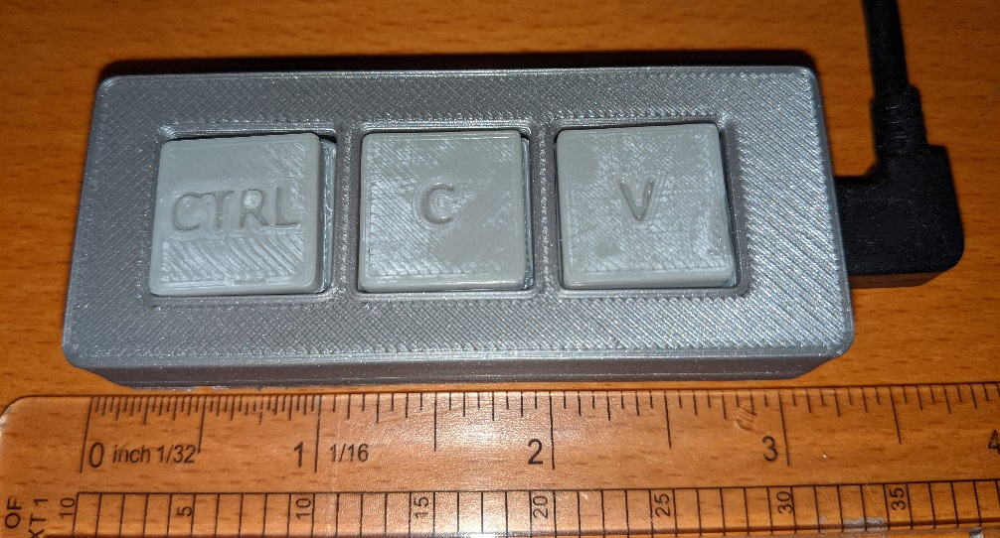

# copy-paste-keyboard

## Background
Many people joke that there's a library for everything and no new code needs to be developed. You can just copy and paste code snippets to write your application.

One of my colleagues posted an image of a "software engineer's keyboard" (only having the ctrl, c, and v keys) of one in the team Slack channels and I knew I needed to make one. See examples [here](https://lmgtfy.app/?q=copy+paste+keyboard&t=i)

Because this is based on an Arduino Pro Micro, when connected to a computer via usb cable, this acts fully as a keyboard with those 3 keys. It can be plugged into a computer that already has a keyboard. 

Pressing ctrl+c or ctrl+v does a cut or paste. Pressing only the c or v key is like pressing that character on a standard keyboard.

## Overview
This is a proper maker project and involves a bit of mechanics, electronics and software.

Mechanics: 
* 3d printed buttons and case

Electronics: (all available from vetco.net)
* Arduino Pro Micro 
* Protoboard
* 10k resistors
* momentary push button switches

Software:
* Simple code for the Arduino Pro Micro

## Repo contents
* arduino - code for Arduino Pro Micro
* circuit - bitmap image of protoboard layout when viewed from the top
* stl_file - raw stl files. gcode for PLA parts printed on a Prusa 3i

## Build notes
* I cut the post on the momentary switch off with a dremel
* I cut a protoboard to be 6 x 20 holes
* Initially I used a 1x3 pin headers to attach the protoboard to the Arduino but found it was nearly impossible to separate them so I used 3 short wires

## Other pictures
* Shows momentary switch with original post

* Bottom view

* Assembled in case

## Motivation
This project was created to participate in [Vetco.net's maker contest](https://vetco.net/blog/contest-show-us-what-you-ve-used-our-parts-to-build-500-in-prizes/2021-08-20-11-08-51-0700)